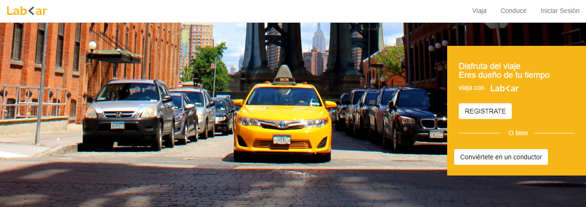
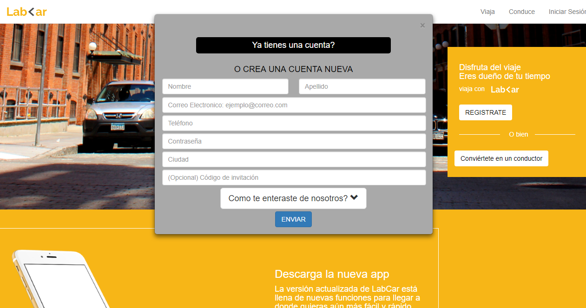
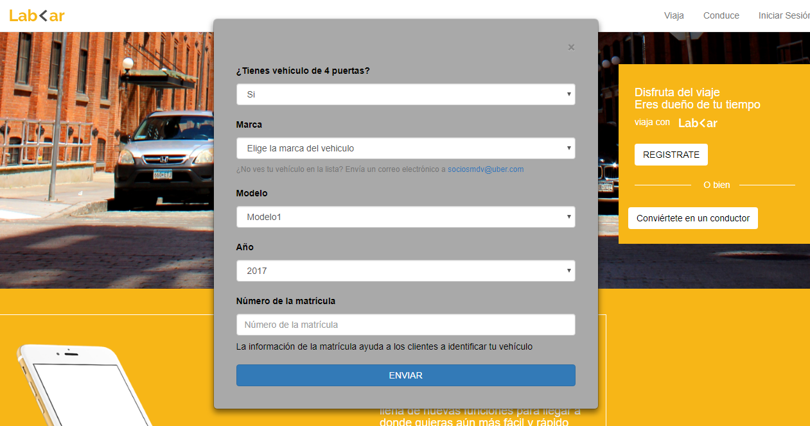
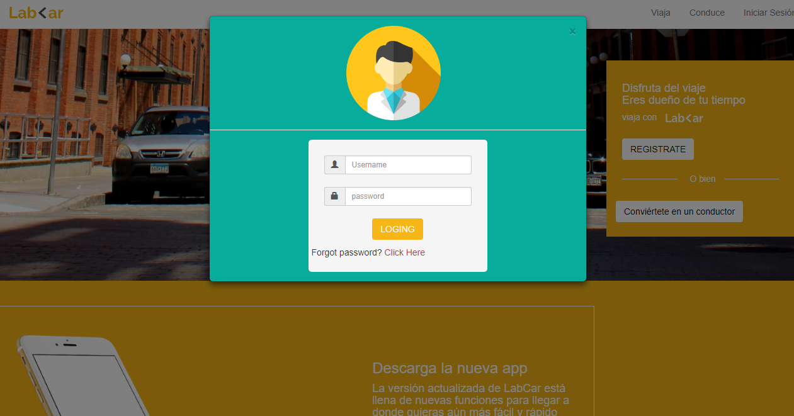

# LabCar
___
LabCar es una pagina web donde se toma en practica el framework Bootstrap 3 y agregado de modales, prueba la experiencia y dale click a los siguientes botones: Regístrate, conviértete en conductor, Iniciar Sesión.

# Desarrollado para

[Laboratoria](http://www.laboratoria.la/)
___

* Realización de pagina web en visualizacion desktop y mobile con booststrap 3.
* Agregado de modales en los siguientes botones: Iniciar Sesión, Registro,Conviertete en Conductor (este se puede ver en ambos botones dentro de la pagina).

**Modales:**
* Registrate:

* Conviertete en conductor:

* Iniciar sesión:

